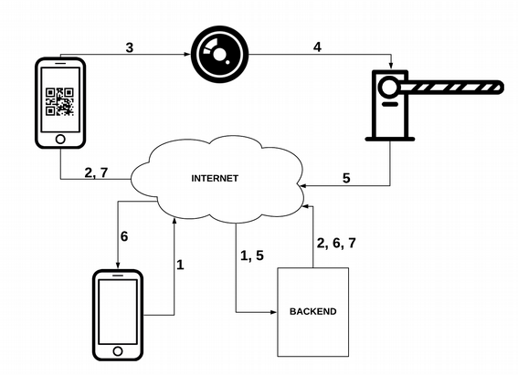

# SIHS

Projeto da disciplina de Sistemas Integrados de Hardware e Software.

## Arquitetura

Demonstração da arquitetura e seu fluxo principal.

1. Usuário A envia permissão de entrada para usuário B;
2. Sistema valida a permissão e envia QR Code para usuário B;
3. Usuário B mostra QR Code no leitor de QR Code;
4. Leitor de QR Code envia confirmação de leitura para dispositivo que controla a entrada;
5. Dispositivo libera entrada e envia confirmação para o Sistema;
6. Sistema notifica usuário A;
7. Sistema notifica usuário B.

## Licença

Este projeto está licenciado sob os termos da licença MIT - consulte o arquivo LICENSE para obter detalhes.
